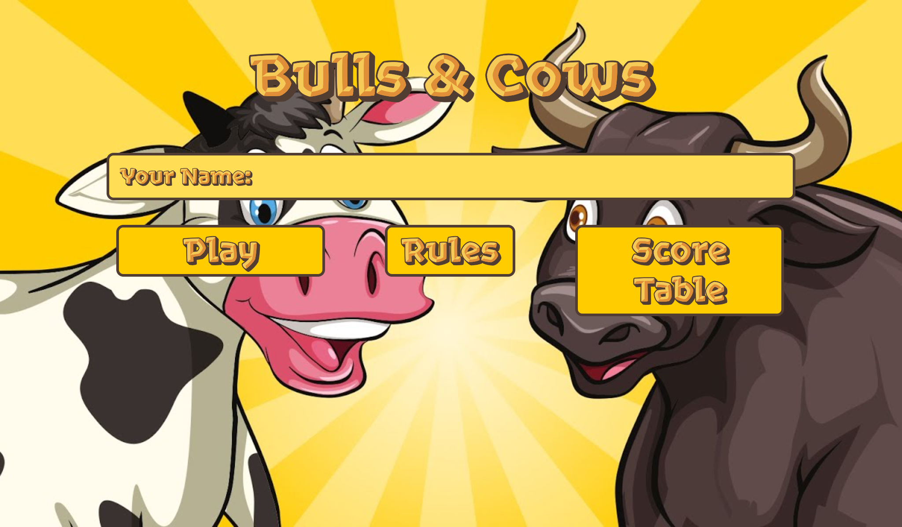
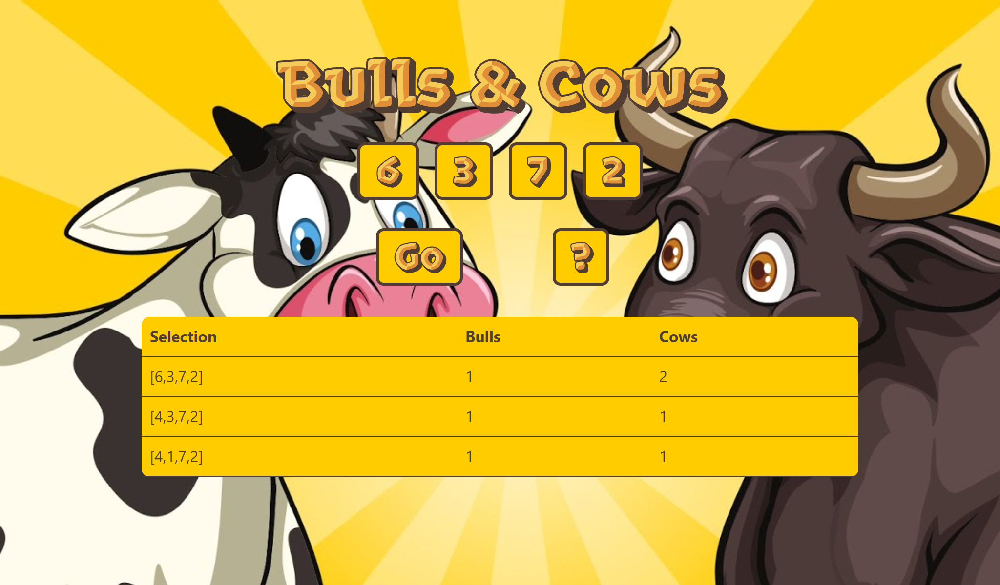
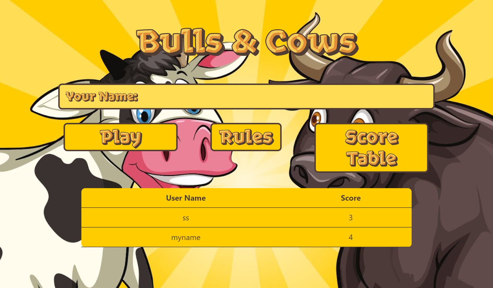

## Authors

* Name: Hagay Elbaz.
* Email: [hagaye4915@gmail.com](mailto:hagaye4915@gmail.com)

## Explanations

This is a simple Bulls & Cows game developed using React on the client side and Java on the server side. The game is a
number guessing game where the player tries to guess a randomly generated four-digit number with the help of feedback
given by the game.

## Game Rules

The game generates a four-digit number with distinct digits. The player has to guess the number, and the game will give
feedback in the form of bulls and cows. A bull means that the player has guessed a digit in the correct position, and a
cow means that the player has guessed a digit correctly, but it is in the wrong position.

For example, if the generated number is 1234, and the player's guess is 1567, then the feedback will be "1 bull, 0 cows"
because the player has guessed the digit 1 in the correct position.

The game continues until the player has guessed the number correctly, or the player has used up all their attempts.

## Server Side

The server side is implemented in Java, and it saves the best score for each user. The server stores the scores in a
file named "scores.dat" in the server's root directory. The server allows cross-origin requests from the React frontend,
and it handles POST requests to save the player's score.

Enjoy playing the Bulls & Cows game!

## How to use this template

This is the template for a project where front-end and back-end are separated.
The front-end is a React application, the back-end is a Java Web application
including a Servlet for REST API endpoints.

### Create a run configuration for the Server

* In IntelliJ, go to Run->Edit Configurations
* Click on the + sign and select Tomcat Server -> Local
* In the Tomcat Server Settings, select your local installation of tomcat (you can download it
  from https://archive.apache.org/dist/tomcat/tomcat-9/v9.0.45/bin/apache-tomcat-9.0.45.tar.gz)
* In the Deployment tab, select the java-react:war file to deploy (the war file in the target folder of your project),
  IntelliJ should automatically detect it and display a "Fix" button. Click on it.
* Make sure the Application context is set to "/" and the url at the server tab is http://localhost:8080/
* uncheck the "After launch: Open in browser" checkbox (this is not needed)
* Click on the OK button

### dependencies

The template depends on:

* your local installation of tomcat, this template uses
  tomcat 9.0.45 that can be downloaded
  from https://archive.apache.org/dist/tomcat/tomcat-9/v9.0.45/bin/apache-tomcat-9.0.45.tar.gz.
  In order to point to your own installation of tomcat, edit configuration in IntelliJ change the application server.
* your local installation of nodejs, this template is based on nodejs v18.15.0 (npm 9.5.0). You can download it
  from https://nodejs.org/en/download.
* your local installation of java (select one SDK at: File->Project Structure->Platform SDK). You can add SDK from
  IntelliJ by cliking on File->Project Structure->Platform Settings-> +).
  This template is based on version 19, you can also download it from https://jdk.java.net/19/).

### source files

The template includes:

* a Java Web template with an empty Servlet to implement your server side REST API under the src/main/java folder
* a React template under the react-client folder, with an initialized npm project.

## In order to run your this template:

* run the server side; with IntelliJ configuration at the upper right (created above)
* run the client side: open the terminal: `cd react-client`, `npm install`, run with the command `npm start`

Then browse:

* your react client at http://localhost:3000
* your server will be available at http://localhost:8080/api/highscores of 'http://localhost:8080/api/')

## Screenshots

